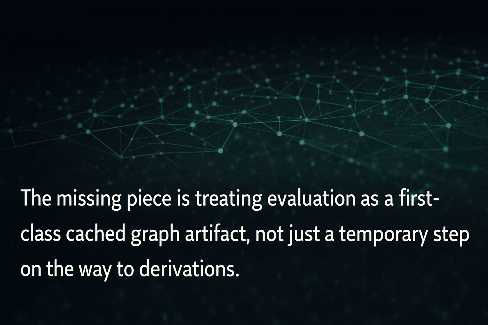

# Scott Edlund

> Treating evaluation as a first-class cached graph artifact.

---

## 🧠 Focus

* Graph-native systems design
* Declarative infrastructure (Nix, Kubernetes)
* Evaluation, caching, and reproducibility
* Composable architectures beyond file-based repos

---

## ⚙️ Current Work

* FleetNix + CAPI integration
* Cluster bootstrapping + secret flows (SOPS, Clan)
* Exploring graph-based program representation

---

## 🧩 Ideas I'm Exploring

* Evaluation as a persistent artifact (not ephemeral)
* Language-agnostic program graphs
* Function-level composability + caching
* Replacing file-based repos with graph materializations

---

## 🛠️ Stack

* Nix / NixOS / Home Manager
* Kubernetes (k3s, GitOps direction)
* Terraform / OpenTofu
* Linux + cloud infra

---

## 📡 Signal > Noise

I care about:

* correctness
* reproducibility
* composability
* leverage

---

<!-- optional flex -->

<!--
## 🔗 Links
- Blog: ...
- X: ...
- etc
-->
